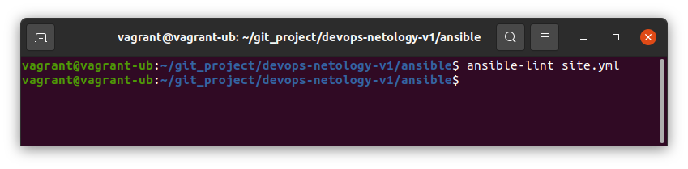
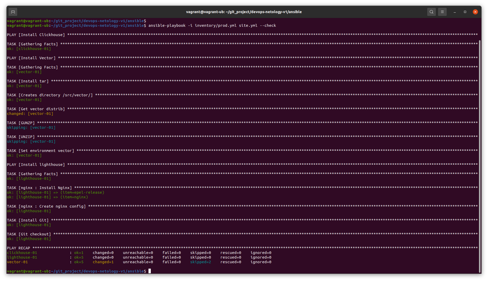
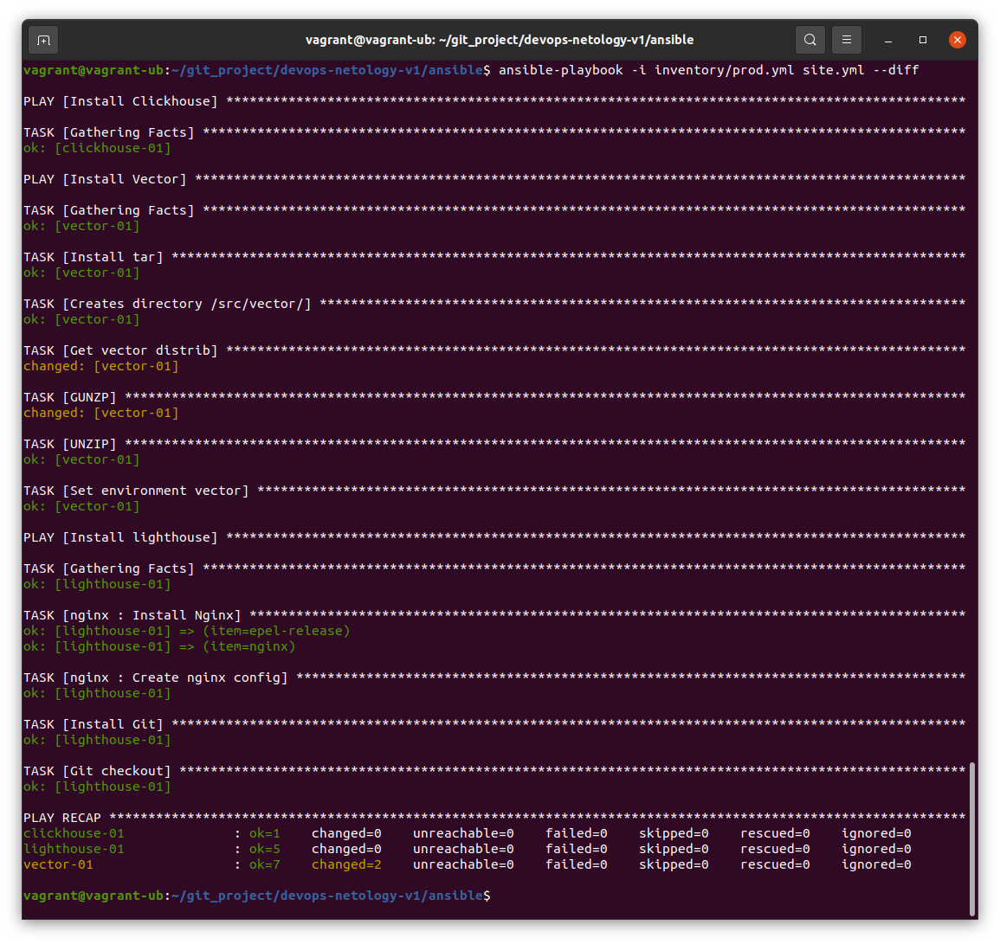
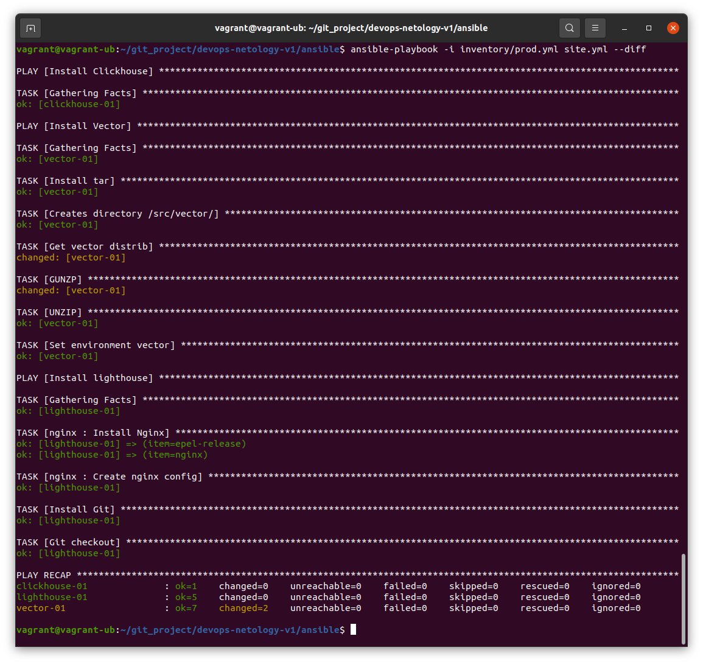

# Домашнее задание к занятию "08.03 Использование Yandex Cloud"

## Подготовка к выполнению

1. Подготовьте в Yandex Cloud три хоста: для `clickhouse`, для `vector` и для `lighthouse`.

Ссылка на репозиторий LightHouse: https://github.com/VKCOM/lighthouse

## Основная часть

1. Допишите playbook: нужно сделать ещё один play, который устанавливает и настраивает lighthouse.
```
Ответ: Дописал
```
2. При создании tasks рекомендую использовать модули: `get_url`, `template`, `yum`, `apt`.
3. Tasks должны: скачать статику lighthouse, установить nginx или любой другой webserver, настроить его конфиг для открытия lighthouse, запустить webserver.
```
Ответ: плейбук поднимает web-сервер Nginx, настраивает конфиг и копирует файлы lighthouse 
```
4. Приготовьте свой собственный inventory файл `prod.yml`.
```
Ответ: Приготовил
```
5. Запустите `ansible-lint site.yml` и исправьте ошибки, если они есть.
<p align="center">

</p>
6. Попробуйте запустить playbook на этом окружении с флагом `--check`.
<p align="center">

</p>
7. Запустите playbook на `prod.yml` окружении с флагом `--diff`. Убедитесь, что изменения на системе произведены.
<p align="center">

</p>
8. Повторно запустите playbook с флагом `--diff` и убедитесь, что playbook идемпотентен.
<p align="center">

</p>
9. Подготовьте README.md файл по своему playbook. В нём должно быть описано: что делает playbook, какие у него есть параметры и теги.

```
Ответ: 
Плейбук разворачивает ClickHouse и устанавливает Vector, также он устанавливает LightHouse для работы которого устанавливает и настраивает nginx.
настройки управляемых серверов задаются в файле prod.yml
"group_vars/clickhouse/var.yml" - версия Кликхауса
"group_vars/vector/var.yml" - версия Вектора
LightHouse - устанавливается последняя версия из репозитория. В плейбуке таска "Git checkout"

```

10. Готовый playbook выложите в свой репозиторий, поставьте тег `08-ansible-03-yandex` на фиксирующий коммит, в ответ предоставьте ссылку на него.


Ссылка на ответ https://github.com/MankovSO/ansible/tree/08-ansible-03-yandex
---

### Как оформить ДЗ?

Выполненное домашнее задание пришлите ссылкой на .md-файл в вашем репозитории.

---