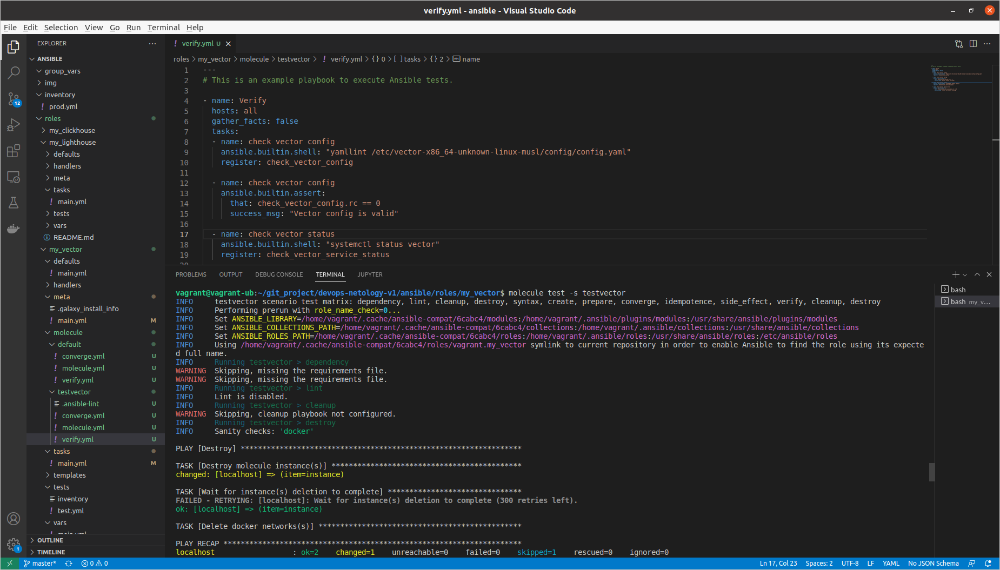
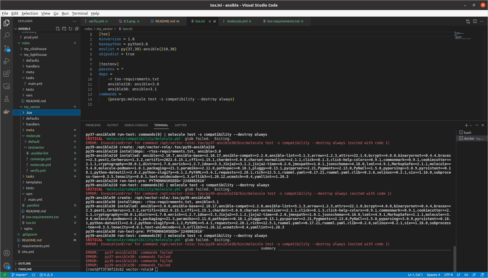
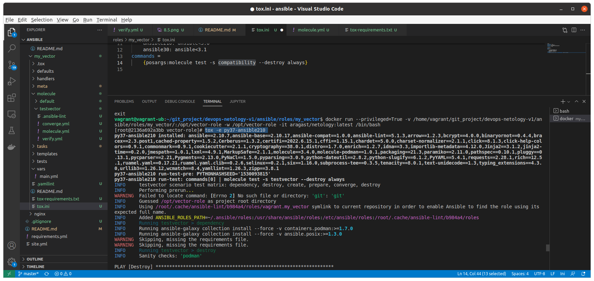
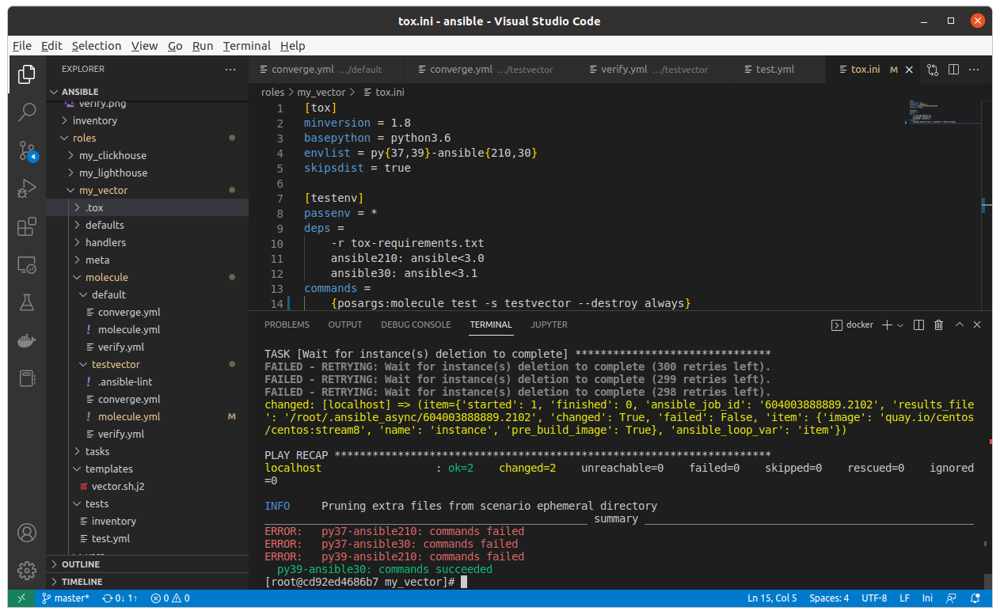

# Домашнее задание к занятию "08.05 Тестирование Roles"

## Подготовка к выполнению
1. Установите molecule: `pip3 install "molecule==3.5.2"`
2. Выполните `docker pull aragast/netology:latest` -  это образ с podman, tox и несколькими пайтонами (3.7 и 3.9) внутри

## Основная часть

Наша основная цель - настроить тестирование наших ролей. Задача: сделать сценарии тестирования для vector. Ожидаемый результат: все сценарии успешно проходят тестирование ролей.

### Molecule

1. Запустите  `molecule test -s centos7` внутри корневой директории clickhouse-role, посмотрите на вывод команды.
2. Перейдите в каталог с ролью vector-role и создайте сценарий тестирования по умолчанию при помощи `molecule init scenario --driver-name docker`.
3. Добавьте несколько разных дистрибутивов (centos:8, ubuntu:latest) для инстансов и протестируйте роль, исправьте найденные ошибки, если они есть.
4. Добавьте несколько assert'ов в verify.yml файл для  проверки работоспособности vector-role (проверка, что конфиг валидный, проверка успешности запуска, etc). Запустите тестирование роли повторно и проверьте, что оно прошло успешно.
5. Добавьте новый тег на коммит с рабочим сценарием в соответствии с семантическим версионированием.

```
Ответ:
иденпотентность не получилась учитывая особенности установки vector на CentOS, остальное вроде получилось.

```
<p align="center">

</p>
### Tox

1. Добавьте в директорию с vector-role файлы из [директории](./example)
2. Запустите `docker run --privileged=True -v <path_to_repo>:/opt/vector-role -w /opt/vector-role -it aragast/netology:latest /bin/bash`, где path_to_repo - путь до корня репозитория с vector-role на вашей файловой системе.
```
ответ: Создал оказался в контейнере
```
3. Внутри контейнера выполните команду `tox`, посмотрите на вывод.
```
<p align="center">

</p>
```
5. Создайте облегчённый сценарий для `molecule` с драйвером `molecule_podman`. Проверьте его на исполнимость.
```
Создал, запустил только по одному окружению:
```
<p align="center">

</p>
6. Пропишите правильную команду в `tox.ini` для того чтобы запускался облегчённый сценарий.

```
Ответ:
не менял файл - запускал командой (см.выше)
Сократил число этапов для tox
```
8. Запустите команду `tox`. Убедитесь, что всё отработало успешно.
```
Ответ: не все успешно, но работает, были проблемы с uts (когда ранее сдавал), но Алексей Метляков поправил свой образ и завелось норм (многое пробовал, но не получалось в контейнере в файле /etc/containers/containers.conf поменять значение utsns на private utsns="private")
также изменил команду запуска контейнера на: docker run --privileged=True -v /home/vagrant/git_project/devops-netology-v1/ansible/roles/my_vector:/opt/my_vector -w /opt/my_vector -it aragast/netology:latest /bin/bash
```
<p align="center">

</p>

9. Добавьте новый тег на коммит с рабочим сценарием в соответствии с семантическим версионированием.

После выполнения у вас должно получится два сценария molecule и один tox.ini файл в репозитории. Ссылка на репозиторий являются ответами на домашнее задание. Не забудьте указать в ответе теги решений Tox и Molecule заданий.

## Необязательная часть

1. Проделайте схожие манипуляции для создания роли lighthouse.
2. Создайте сценарий внутри любой из своих ролей, который умеет поднимать весь стек при помощи всех ролей.
3. Убедитесь в работоспособности своего стека. Создайте отдельный verify.yml, который будет проверять работоспособность интеграции всех инструментов между ними.
4. Выложите свои roles в репозитории. В ответ приведите ссылки.

---

### Как оформить ДЗ?

Выполненное домашнее задание пришлите ссылкой на .md-файл в вашем репозитории.

---