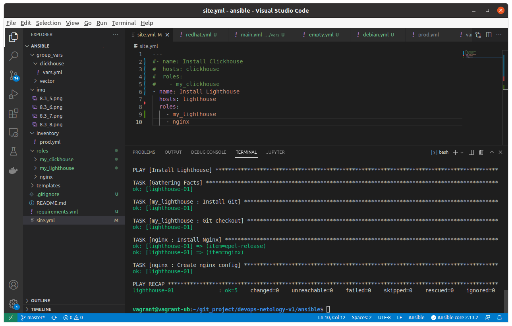

# Домашнее задание к занятию "8.4 Работа с Roles"

## Подготовка к выполнению
1. (Необязательно) Познакомтесь с [lighthouse](https://youtu.be/ymlrNlaHzIY?t=929)
2. Создайте два пустых публичных репозитория в любом своём проекте: vector-role и lighthouse-role.
3. Добавьте публичную часть своего ключа к своему профилю в github.

## Основная часть

Наша основная цель - разбить наш playbook на отдельные roles. Задача: сделать roles для clickhouse, vector и lighthouse и написать playbook для использования этих ролей. Ожидаемый результат: существуют три ваших репозитория: два с roles и один с playbook.

1. Создать в старой версии playbook файл `requirements.yml` и заполнить его следующим содержимым:

   ```yaml
   ---
     - src: git@github.com:AlexeySetevoi/ansible-clickhouse.git
       scm: git
       version: "1.11.0"
       name: clickhouse 
   ```
Я это скопировал, роль установил она там выдает ошибку, но это не относится к заданию и я оставил как есть.

2. При помощи `ansible-galaxy` скачать себе эту роль.
3. Создать новый каталог с ролью при помощи `ansible-galaxy role init vector-role`.
4. На основе tasks из старого playbook заполните новую role. Разнесите переменные между `vars` и `default`. 
5. Перенести нужные шаблоны конфигов в `templates`.
6. Описать в `README.md` обе роли и их параметры.
7. Повторите шаги 3-6 для lighthouse. Помните, что одна роль должна настраивать один продукт.
8. Выложите все roles в репозитории. 
https://github.com/MankovSO/my_vector/releases/tag/1.0.1
https://github.com/MankovSO/my_lighthouse/releases/tag/1.0.1

Проставьте тэги, используя семантическую нумерацию Добавьте roles в `requirements.yml` в playbook.

9. Переработайте playbook на использование roles. Не забудьте про зависимости lighthouse и возможности совмещения `roles` с `tasks`.

веб сервер у меня до этого ставился локальной ролью я так и оставил.

10. Выложите playbook в репозиторий.
11. В ответ приведите ссылки на оба репозитория с roles и одну ссылку на репозиторий с playbook.

На роли ссылки выше, в плейбуке Вы сейчас находитесь)


несколько скриншотов по структуре и работе ролей:

на этом скриншоте запустил lighthouse
<p align="center">

</p>
на этом скриншоте удалены папки с переменными чтобы продемонстрировать что все берется из ролей. 

<p align="center">

</p>

вот так стал выглядеть плейбук:
<p align="center">

</p>

---


### Как оформить ДЗ?

Выполненное домашнее задание пришлите ссылкой на .md-файл в вашем репозитории.

---